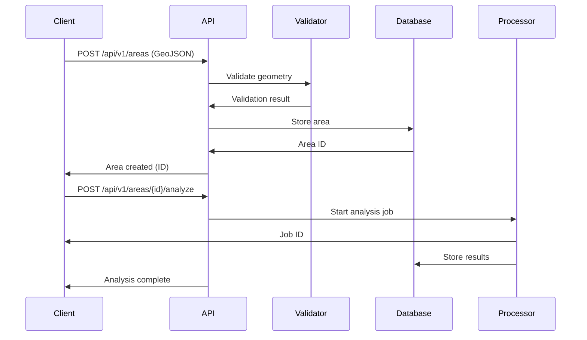

# 🗺️ System Evolution Roadmap: Client-Submitted Geospatial Areas

## 🎯 **Executive Summary**

The current soil analysis pipeline can evolve from a **country-based batch processor** into a **flexible, client-driven geospatial analysis platform**. This evolution would enable clients to submit their own custom geographic areas and receive tailored soil analysis results through a modern API-driven architecture.

---

## 🔄 **Current State → Future Vision**

### **Current System Limitations**
- ❌ **Fixed boundaries**: Only European countries supported
- ❌ **Batch processing**: No real-time analysis
- ❌ **Single tenant**: No client isolation
- ❌ **Limited flexibility**: Predefined clustering strategies
- ❌ **No API**: Command-line only interface

### **Future System Capabilities**
- ✅ **Custom areas**: Any polygon/region supported
- ✅ **Real-time API**: Instant analysis requests
- ✅ **Multi-tenant**: Multiple clients with isolated data
- ✅ **Adaptive clustering**: Dynamic based on area characteristics
- ✅ **RESTful API**: Modern web service interface

---

## 🏗️ **Architecture Evolution**

### **Phase 1: API Foundation (Months 1-2)**

#### **New Components to Add:**

1. **API Gateway Layer**
```python
# FastAPI application structure
app = FastAPI(title="Geospatial Soil Analysis API")

@app.post("/api/v1/areas")
async def create_area(area: GeospatialArea, client: Client):
    """Client submits custom geospatial area"""
    # Validate geometry
    # Store in database
    # Return area ID
```

2. **Multi-Tenant Database Schema**
```sql
-- New tables for client management
CREATE TABLE clients (
    id UUID PRIMARY KEY,
    name VARCHAR(255) NOT NULL,
    api_key VARCHAR(255) UNIQUE NOT NULL,
    subscription_tier VARCHAR(50) NOT NULL
);

CREATE TABLE geospatial_areas (
    id UUID PRIMARY KEY,
    client_id UUID NOT NULL,
    name VARCHAR(255) NOT NULL,
    geometry GEOMETRY(POLYGON, 4326) NOT NULL,
    status VARCHAR(50) DEFAULT 'pending'
);
```

3. **Authentication & Authorization**
```python
class SecurityService:
    def validate_api_key(self, api_key: str) -> Optional[Client]:
        """Validate client API key"""
        
    def check_area_permissions(self, client_id: str, area_id: str) -> bool:
        """Check if client owns the area"""
```

### **Phase 2: Enhanced Spatial Processing (Months 3-4)**

#### **Modified Components:**

1. **Dynamic Spatial Processor**
```python
class DynamicSpatialProcessor:
    def associate_samples_with_custom_area(self, 
                                         soil_samples: gpd.GeoDataFrame,
                                         area_geometry: Dict) -> Dict[int, bool]:
        """Associate soil samples with client-submitted area"""
        # Parse client geometry (GeoJSON, WKT, Shapefile)
        # Perform spatial intersection
        # Return sample associations
```

2. **Adaptive Clustering Engine**
```python
class AdaptiveClusteringProcessor:
    def cluster_custom_area(self, area_samples: pd.DataFrame,
                          area_characteristics: Dict) -> List[Dict]:
        """Cluster samples based on area characteristics"""
        # Analyze area size, sample density, terrain
        # Choose optimal clustering strategy
        # Perform clustering with appropriate parameters
```

3. **Geometry Validation Service**
```python
class GeometryValidator:
    def validate_client_geometry(self, geometry: Dict) -> ValidationResult:
        """Validate client-submitted geometries"""
        # Check format (GeoJSON, WKT, Shapefile)
        # Validate coordinate system
        # Check for self-intersections
        # Verify area size limits
```

### **Phase 3: Real-Time Processing (Months 5-6)**

#### **New Infrastructure:**

1. **Asynchronous Task Queue**
```python
# Celery configuration for background processing
@celery_app.task
def analyze_custom_area(area_id: str, client_id: str, parameters: Dict):
    """Background task for area analysis"""
    # Get area geometry
    # Perform spatial association
    # Run clustering
    # Calculate statistics
    # Store results
    # Generate visualizations
```

2. **Real-Time Status Updates**
```python
class AnalysisStatusService:
    def get_job_status(self, job_id: str) -> Dict:
        """Get real-time analysis status"""
        return {
            'job_id': job_id,
            'status': 'running',
            'progress': 65,
            'stage': 'clustering',
            'estimated_completion': '2024-01-15T14:30:00Z'
        }
```

3. **WebSocket Notifications**
```python
@app.websocket("/ws/analysis/{job_id}")
async def analysis_status_websocket(websocket: WebSocket, job_id: str):
    """Real-time status updates via WebSocket"""
    await websocket.accept()
    while True:
        status = get_job_status(job_id)
        await websocket.send_json(status)
        if status['status'] in ['completed', 'failed']:
            break
```

---

## 🔧 **Technical Implementation Details**

### **1. Client Area Submission Flow**



### **2. Enhanced Database Schema**

```sql
-- Extended schema for client areas
CREATE TABLE geospatial_areas (
    id UUID PRIMARY KEY DEFAULT gen_random_uuid(),
    client_id UUID NOT NULL REFERENCES clients(id),
    name VARCHAR(255) NOT NULL,
    description TEXT,
    geometry GEOMETRY(POLYGON, 4326) NOT NULL,
    area_size_km2 DECIMAL(10,2) NOT NULL,
    status VARCHAR(50) DEFAULT 'pending',
    analysis_parameters JSONB,
    created_at TIMESTAMP DEFAULT CURRENT_TIMESTAMP,
    updated_at TIMESTAMP DEFAULT CURRENT_TIMESTAMP
);

-- Spatial index for efficient queries
CREATE INDEX idx_geospatial_areas_geometry ON geospatial_areas USING GIST (geometry);
CREATE INDEX idx_geospatial_areas_client ON geospatial_areas (client_id);
CREATE INDEX idx_geospatial_areas_status ON geospatial_areas (status);

-- Analysis jobs tracking
CREATE TABLE analysis_jobs (
    id UUID PRIMARY KEY DEFAULT gen_random_uuid(),
    area_id UUID NOT NULL REFERENCES geospatial_areas(id),
    client_id UUID NOT NULL REFERENCES clients(id),
    status VARCHAR(50) DEFAULT 'pending',
    progress INTEGER DEFAULT 0,
    stage VARCHAR(100),
    parameters JSONB,
    results_id UUID REFERENCES analysis_results(id),
    created_at TIMESTAMP DEFAULT CURRENT_TIMESTAMP,
    completed_at TIMESTAMP
);
```

### **3. API Endpoint Design**

```python
# Complete API specification
from fastapi import FastAPI, HTTPException, Depends
from pydantic import BaseModel
from typing import Optional, List

app = FastAPI(title="Geospatial Soil Analysis API", version="2.0.0")

# Request/Response models
class GeospatialArea(BaseModel):
    name: str
    description: Optional[str] = None
    geometry: Dict  # GeoJSON format
    analysis_parameters: Optional[Dict] = None

class AnalysisRequest(BaseModel):
    sampling_method: str = "single_cluster"
    sample_size: int = 100
    clustering_strategy: str = "adaptive"
    include_visualizations: bool = True

class AnalysisResponse(BaseModel):
    job_id: str
    status: str
    estimated_completion: Optional[str] = None

# Area management endpoints
@app.post("/api/v1/areas", response_model=Dict[str, str])
async def create_area(area: GeospatialArea, client: Client = Depends(get_client)):
    """Create a new geospatial area for analysis"""
    
@app.get("/api/v1/areas", response_model=List[Dict])
async def list_areas(client: Client = Depends(get_client)):
    """List all areas for the client"""
    
@app.get("/api/v1/areas/{area_id}", response_model=Dict)
async def get_area(area_id: str, client: Client = Depends(get_client)):
    """Get details of a specific area"""

# Analysis endpoints
@app.post("/api/v1/areas/{area_id}/analyze", response_model=AnalysisResponse)
async def analyze_area(area_id: str, request: AnalysisRequest, 
                      client: Client = Depends(get_client)):
    """Trigger analysis for a geospatial area"""
    
@app.get("/api/v1/analysis/{job_id}/status")
async def get_analysis_status(job_id: str, client: Client = Depends(get_client)):
    """Get status of analysis job"""
    
@app.get("/api/v1/areas/{area_id}/results")
async def get_analysis_results(area_id: str, client: Client = Depends(get_client)):
    """Get analysis results for an area"""

# Visualization endpoints
@app.get("/api/v1/areas/{area_id}/map")
async def get_interactive_map(area_id: str, client: Client = Depends(get_client)):
    """Get interactive map with analysis results"""
    
@app.get("/api/v1/areas/{area_id}/report")
async def get_pdf_report(area_id: str, client: Client = Depends(get_client)):
    """Get comprehensive PDF report"""
```

### **4. Enhanced Spatial Processing**

```python
class EnhancedSpatialProcessor:
    """Enhanced spatial processor for custom areas"""
    
    def __init__(self, logger):
        self.logger = logger
        self.geometry_parser = GeometryParser()
    
    def process_custom_area(self, area_geometry: Dict, 
                          soil_samples: gpd.GeoDataFrame) -> Dict:
        """Process soil samples for custom geospatial area"""
        
        # Parse client geometry
        area_polygon = self.geometry_parser.parse(area_geometry)
        
        # Validate area characteristics
        area_size = self._calculate_area_size(area_polygon)
        sample_density = len(soil_samples) / area_size
        
        # Perform spatial association
        associations = self._associate_samples_with_area(soil_samples, area_polygon)
        
        # Filter samples within area
        area_samples = soil_samples[associations.values()]
        
        return {
            'area_polygon': area_polygon,
            'area_size_km2': area_size,
            'sample_density': sample_density,
            'samples_within_area': len(area_samples),
            'area_samples': area_samples
        }
    
    def _associate_samples_with_area(self, soil_samples: gpd.GeoDataFrame,
                                   area_polygon: Polygon) -> Dict[int, bool]:
        """Associate soil samples with custom area"""
        within_area = soil_samples.geometry.within(area_polygon)
        return {sample_id: within for sample_id, within in zip(soil_samples.index, within_area)}
    
    def _calculate_area_size(self, polygon: Polygon) -> float:
        """Calculate area size in square kilometers"""
        # Convert to appropriate projection for area calculation
        # Return area in km²
        pass
```

### **5. Adaptive Clustering for Custom Areas**

```python
class AdaptiveClusteringProcessor:
    """Adaptive clustering based on area characteristics"""
    
    def cluster_custom_area(self, area_samples: pd.DataFrame,
                          area_characteristics: Dict) -> List[Dict]:
        """Cluster samples based on area characteristics"""
        
        # Analyze area characteristics
        area_size = area_characteristics['area_size_km2']
        sample_density = area_characteristics['sample_density']
        sample_count = len(area_samples)
        
        # Determine optimal clustering strategy
        if sample_density > 100:  # High density
            strategy = 'density_based'
            n_clusters = min(20, sample_count // 50)
        elif area_size > 1000:  # Large area
            strategy = 'grid_based'
            n_clusters = max(5, int(area_size / 100))
        else:  # Standard case
            strategy = 'kmeans'
            n_clusters = min(10, sample_count // 30)
        
        # Perform clustering
        if strategy == 'density_based':
            clusters = self._density_based_clustering(area_samples, n_clusters)
        elif strategy == 'grid_based':
            clusters = self._grid_based_clustering(area_samples, area_characteristics)
        else:
            clusters = self._kmeans_clustering(area_samples, n_clusters)
        
        return clusters
    
    def _density_based_clustering(self, samples: pd.DataFrame, n_clusters: int) -> List[Dict]:
        """Density-based clustering for high-density areas"""
        from sklearn.cluster import DBSCAN
        
        coords = samples[['latitude', 'longitude']].values
        clustering = DBSCAN(eps=0.01, min_samples=5).fit(coords)
        
        return self._format_clusters(samples, clustering.labels_)
    
    def _grid_based_clustering(self, samples: pd.DataFrame, 
                             area_characteristics: Dict) -> List[Dict]:
        """Grid-based clustering for large areas"""
        # Divide area into grid cells
        # Assign samples to grid cells
        # Create clusters from grid cells
        pass
    
    def _kmeans_clustering(self, samples: pd.DataFrame, n_clusters: int) -> List[Dict]:
        """Standard K-means clustering"""
        from sklearn.cluster import KMeans
        
        coords = samples[['latitude', 'longitude']].values
        kmeans = KMeans(n_clusters=n_clusters, random_state=42)
        cluster_labels = kmeans.fit_predict(coords)
        
        return self._format_clusters(samples, cluster_labels)
```

---

## 🚀 **Deployment Architecture**

### **Microservices Architecture**

```yaml
# docker-compose.yml for production
version: '3.8'
services:
  # API Gateway
  nginx:
    image: nginx:alpine
    ports:
      - "80:80"
      - "443:443"
    volumes:
      - ./nginx.conf:/etc/nginx/nginx.conf
    depends_on:
      - api-service
  
  # Main API Service
  api-service:
    build: .
    environment:
      - DATABASE_URL=postgresql://user:pass@db:5432/soil_analysis
      - REDIS_URL=redis://redis:6379
      - CELERY_BROKER_URL=redis://redis:6379
    depends_on:
      - db
      - redis
  
  # Background Processing
  celery-worker:
    build: .
    command: celery -A app.celery worker --loglevel=info
    environment:
      - DATABASE_URL=postgresql://user:pass@db:5432/soil_analysis
      - REDIS_URL=redis://redis:6379
    depends_on:
      - db
      - redis
  
  # Database
  db:
    image: postgis/postgis:13-3.1
    environment:
      - POSTGRES_DB=soil_analysis
      - POSTGRES_USER=user
      - POSTGRES_PASSWORD=pass
    volumes:
      - postgres_data:/var/lib/postgresql/data
  
  # Cache
  redis:
    image: redis:alpine
    ports:
      - "6379:6379"
  
  # Monitoring
  prometheus:
    image: prom/prometheus
    ports:
      - "9090:9090"
    volumes:
      - ./prometheus.yml:/etc/prometheus/prometheus.yml
  
  grafana:
    image: grafana/grafana
    ports:
      - "3000:3000"
    environment:
      - GF_SECURITY_ADMIN_PASSWORD=admin
```

### **Scaling Strategy**

```python
# Horizontal scaling configuration
class ScalingConfig:
    """Configuration for horizontal scaling"""
    
    # Auto-scaling rules
    SCALING_RULES = {
        'cpu_threshold': 70,  # Scale up when CPU > 70%
        'memory_threshold': 80,  # Scale up when memory > 80%
        'queue_length_threshold': 100,  # Scale up when queue > 100 jobs
        'min_instances': 2,
        'max_instances': 20
    }
    
    # Load balancing
    LOAD_BALANCER_CONFIG = {
        'algorithm': 'least_connections',
        'health_check_interval': 30,
        'health_check_timeout': 5
    }
```

---

## 💰 **Business Model & Pricing**

### **Subscription Tiers**

| Feature | Starter | Professional | Enterprise |
|---------|---------|--------------|------------|
| **Monthly Price** | $99 | $299 | $999 |
| **Areas** | 5 | 25 | Unlimited |
| **Analyses/month** | 100 | 500 | Unlimited |
| **API Calls/hour** | 100 | 500 | 2000 |
| **Storage** | 1GB | 10GB | 100GB |
| **Support** | Email | Priority | Dedicated |

### **Usage-Based Pricing**

- **Storage**: $0.10/GB/month
- **Analysis**: $0.50 per analysis
- **API Calls**: $0.01 per 1000 calls
- **Custom Development**: $50/hour

---

## 📊 **Success Metrics**

### **Technical KPIs**
- **API Response Time**: < 200ms (cached), < 5s (new analysis)
- **System Uptime**: 99.9% availability
- **Analysis Accuracy**: > 95% spatial association
- **Processing Time**: < 5 minutes for areas < 1000 km²

### **Business KPIs**
- **Client Acquisition**: 50 new clients in first year
- **Revenue Growth**: 300% year-over-year
- **Client Retention**: 90% annual retention
- **Market Penetration**: 10% of target segment

---

## 🔮 **Future Enhancements**

### **Phase 4: AI & ML Integration (Months 7-8)**
- **Predictive Analytics**: Forecast soil changes over time
- **Anomaly Detection**: Identify unusual soil patterns
- **Recommendation Engine**: Suggest optimal land use strategies

### **Phase 5: Ecosystem Integration (Months 9-10)**
- **GIS Software Plugins**: QGIS, ArcGIS integration
- **Agricultural Platforms**: Farm management system integration
- **Environmental Monitoring**: IoT sensor data integration

### **Phase 6: Advanced Analytics (Months 11-12)**
- **Temporal Analysis**: Time-series soil data analysis
- **Comparative Studies**: Cross-region analysis
- **Risk Assessment**: Environmental risk modeling

---

## 🎯 **Implementation Timeline**

### **Month 1-2: Foundation**
- [ ] Database schema migration
- [ ] API development (FastAPI)
- [ ] Authentication system
- [ ] Basic area management

### **Month 3-4: Core Features**
- [ ] Enhanced spatial processing
- [ ] Adaptive clustering
- [ ] Asynchronous processing
- [ ] Basic visualizations

### **Month 5-6: Production Ready**
- [ ] Security hardening
- [ ] Performance optimization
- [ ] Monitoring & alerting
- [ ] Documentation

### **Month 7-8: Launch**
- [ ] Beta testing
- [ ] Production deployment
- [ ] Marketing launch
- [ ] Customer onboarding

---

## 🚀 **Conclusion**

This evolution would transform the current soil analysis pipeline into a **comprehensive, scalable platform** that serves diverse client needs while maintaining the core soil analysis capabilities. The new system would provide:

- ✅ **Flexibility**: Support any custom geospatial area
- ✅ **Scalability**: Handle multiple clients and high throughput
- ✅ **Real-time**: Instant analysis and results
- ✅ **Modern API**: RESTful interface with comprehensive documentation
- ✅ **Business Value**: Subscription-based revenue model

The investment in this evolution would position the platform as a **market leader** in geospatial soil analysis services, serving agricultural, environmental, and research clients worldwide. 